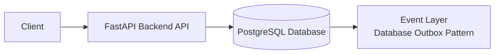

# Modular Monolith Web Banking System

## Architecture Scheme



Core principles:
- JWT Auth
- REST API
- Ledger as single source of truth
- Audit logging
- Database outbox event layer

## Modules

- `auth/`
- `customers/`
- `accounts/`
- `ledger/`
- `transfers/`
- `audit/`

## Backend Stack

- Python + FastAPI
- PostgreSQL (preferred for ledger consistency and transactional safety)
- SQLAlchemy ORM
- JWT authentication

## Database Tables

Required business tables:
1. `users`
2. `customers`
3. `accounts`
4. `ledger_entries`
5. `transfers`
6. `audit_logs`

Additional technical table:
- `outbox_events` (for DB outbox pattern)

## Run with Docker Compose

From `infra/` directory:

```bash
docker compose up --build
```

Services:
- API: [http://localhost:8000](http://localhost:8000)
- Swagger UI: [http://localhost:8000/docs](http://localhost:8000/docs)
- Frontend JS demo: [http://localhost:8080](http://localhost:8080)

## API Draft (Swagger-ready)

Public:
- `POST /register` -> create user
- `POST /auth/token` -> obtain JWT token

Protected:
- `POST /customers` -> create customer (mock KYC fields)
- `POST /accounts` -> create account
- `GET /accounts/{id}` -> get account by id
- `GET /accounts/{id}/balance` -> balance inquiry from ledger
- `POST /accounts/{id}/deposit` -> simulated deposit (creates ledger entry)
- `POST /accounts/{id}/withdraw` -> simulated withdrawal (creates ledger entry)
- `POST /transfers/initiate` -> initiate transfer
- `GET /audit/logs` -> admin audit access

Transfer behavior implemented:
- Existing accounts -> transfer created with `PENDING`
- Any missing account -> `404`
- Action is logged into `audit_logs`
- Outbox event is inserted into `outbox_events`

## Swagger UI: Is direct request execution possible?

Yes. FastAPI Swagger UI allows running requests directly:
1. Open `/docs`
2. Register user via `POST /register`
3. Get token via `POST /auth/token`
4. Click `Authorize` and paste `Bearer <token>`
5. Execute protected endpoints from UI

## Notes on Ledger Rules

- Ledger entries are append-only by API design.
- No balance mutations happen outside `ledger_entries`.
- Balance is computed as `SUM(CREDIT) - SUM(DEBIT)`.
