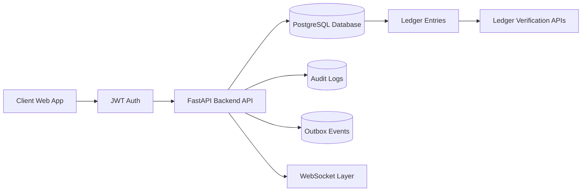

# Modular Monolith Web Banking System


## Architecture Scheme



Core principles:
- JWT Auth
- REST API
- Ledger as single source of truth
- Audit logging
- Database outbox event layer

## Modules

- `auth/`
- `customers/`
- `accounts/`
- `ledger/`
- `transfers/`
- `audit/`

## Stack

- Backend: Python + FastAPI
- DB: PostgreSQL
- ORM: SQLAlchemy
- Events: Database outbox table (`outbox_events`)
- Frontend: JavaScript (minimal demo)
- Frontend: JavaScript multi-page banking UI (landing, auth, customer, admin)
- Runtime: Docker Compose

## Run

From `infra/` directory:

```bash
docker compose up --build
```

Services:
- API: [http://localhost:8000](http://localhost:8000)
- Swagger UI: [http://localhost:8000/docs](http://localhost:8000/docs)
- OpenAPI JSON: [http://localhost:8000/openapi.json](http://localhost:8000/openapi.json)
- Frontend demo: [http://localhost:8080](http://localhost:8080)

## Migrations (Alembic)

Alembic is configured in `backend/alembic.ini`.

Run migrations from the repo root:
```bash
alembic -c backend/alembic.ini upgrade head
```

Run migrations inside Docker:
```bash
docker compose -f infra/docker-compose.yml run --rm backend python -m alembic -c /app/alembic.ini upgrade head
```

Supabase note:
- If you use Supabase, set `DATABASE_URL` in `.env` to the Supabase connection string and add `?sslmode=require`.

## API Draft

Public:
- `POST /register`
- `POST /auth/token`

Protected:
- `POST /customers`
- `GET /customers/{customer_id}`
- `PATCH /customers/{customer_id}/status` (admin)
- `POST /accounts`
- `GET /accounts`
- `GET /accounts/{id}`
- `GET /accounts/{id}/balance`
- `POST /accounts/{id}/deposit`
- `POST /accounts/{id}/withdraw`
- `GET /ledger/accounts/{account_id}/entries`
- `POST /transfers/initiate`
- `POST /transfers/{transfer_id}/execute` (full transfer execution)
- `GET /transfers`
- `GET /transfers/{transfer_id}`
- `GET /ledger/accounts/{account_id}/verify`
- `GET /ledger/verify/system` (admin)
- `GET /audit/logs` (admin)
- `GET /audit/outbox` (admin)
- `POST /audit/outbox/flush` (admin)

WebSocket:
- `GET ws://localhost:8000/ws/events?token=<jwt>`
  - Streams outbox snapshot updates (pending count + latest events)

## Swagger Usage

Yes, direct API execution from Swagger UI is supported.
1. Register via `POST /register`
2. Login via `POST /auth/token`
3. Click `Authorize` in `/docs`
4. Paste token as `Bearer <access_token>`
5. Execute protected endpoints

## Ledger Rules

- Ledger entries are append-only by API design.
- No balance mutation happens outside `ledger_entries`.
- Balance = `SUM(CREDIT) - SUM(DEBIT)`.
- Verification endpoints check ledger integrity at account and system scope.

## Extra Documentation

- Security notes: `docs/security_notes.md`
- Final architecture with security/audit/JWT flow: `docs/architecture_final.md`
- Archived Swagger v0.1 draft notes: `docs/swagger_v0.1.md`

## Mandatory Backend/Security Checklist

### 6. Mandatory Backend Requirements
- `6.1 REST API`: Implemented
- `6.2 OpenAPI (Swagger)`: Implemented (`/docs`, `/openapi.json`)
- `6.3 Input validation`: Implemented via Pydantic schemas and field constraints
- `6.4 Structured logging`: Implemented (JSON request logs + domain event/audit logs)

### 7. Financial Data Transfer & Protocol Awareness
- `7.1 REST / JSON APIs`: Implemented
- `7.2 gRPC`: Optional, not implemented in this version
- `7.3 WebSockets`: Implemented (`/ws/events`)

Real financial systems typically use standards such as ISO 20022, SWIFT, EMV, and Open Banking APIs.
This project uses REST/JSON internally, and conceptually maps as follows:
- ISO 20022/SWIFT message intent -> `transfers`, `ledger_entries`, `outbox_events`
- EMV/card transaction lifecycle -> modeled as auditable events + immutable ledger postings
- Open Banking API pattern -> OAuth/JWT-style protected REST resources (`accounts`, `transactions`, `customers`)

### 8. Security Requirements
- `8.1 Authentication & Authorization`: Implemented
- `8.2 JWT-based authentication`: Implemented
- `8.3 RBAC (Admin/Customer)`: Implemented
- `8.4 API Security`: Implemented via JWT, secure headers, and controlled error responses
- `8.5 Input validation`: Implemented
- `8.6 Rate limiting`: Implemented (configurable middleware)
- `8.7 CORS handling`: Implemented (configurable origins)
- `8.8 Secure error responses`: Implemented (consistent error envelope + generic 500)
- `8.9 Audit Logging`: Implemented
- `8.10 User ID`: Captured in `audit_logs.user_id`
- `8.11 Action performed`: Captured in `audit_logs.action`
- `8.12 Timestamp`: Captured in `audit_logs.timestamp`
- `8.13 Outcome`: Captured in `audit_logs.outcome`
- `8.14 Secrets management`: Implemented
  - `8.14.1 .env.example`: Added at repo root
  - `8.14.2 No secrets committed`: `.env` ignored by git, compose reads env vars

## Environment Variables

See `.env.example` for all configurable values.

Important:
- Use strong `JWT_SECRET` in real environments.
- Do not commit `.env` to GitHub.
 - Set `FINNHUB_API_KEY` for live market data.

## CI/CD

- GitHub Actions pipeline: `.github/workflows/ci.yml`
- Runs on push/PR:
  - Ruff lint checks
  - Pytest unit tests
  - Optional Docker backend build validation
