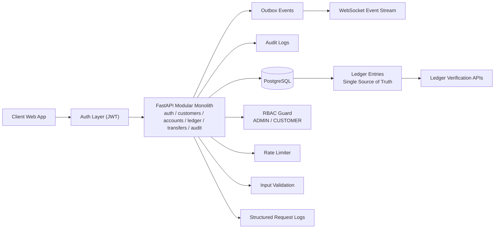

# Final Architecture Diagram

## Data Flow Summary
1. User authenticates and receives JWT.
2. JWT + RBAC gate all protected operations.
3. Financial writes are recorded in ledger and business tables transactionally.
4. Audit logs capture actor/action/outcome/timestamp.
5. Outbox events are emitted for async/event consumers and WebSocket snapshots.
